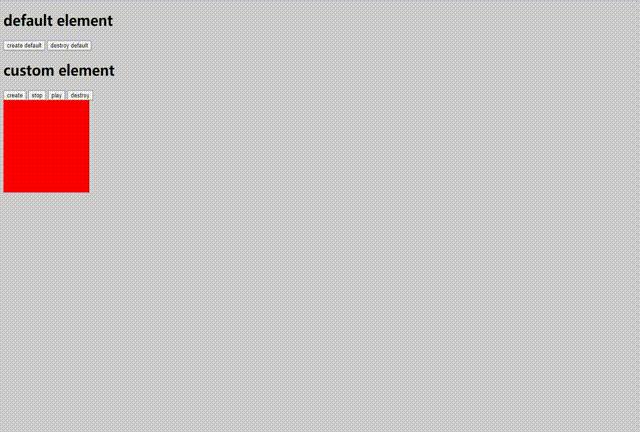

# jquery.bayWindow.js

A jquery plugin that adds the floating window function.

Use requestAnimationFrame and transform

## Example

[example html](./example.html)



## Installation

Include script _after_ the jQuery library (unless you are packaging scripts somehow else):

```html
<script src="/path/to/jquery.bayWindow.js"></script>
```

## Usage

If you want to use the default element(Built-in close button):

```javascript
// If the bayWindowOption is used, the run method will be executed by default
$.createBayWindowElement(createBayWindowElementOption).bayWindow(
  bayWindowOption | methodName
)
```

or use a custom element:

```javascript
$(element).bayWindow(bayWindowOption | methodName)

// if need destroy
$(closeBtn).on('click', function () {
  $(element).bayWindow('destroy')
})
```

use methods:

```javascript
$(element).bayWindow(methodName)
```

## Options for $.createBayWindowElement

<table>
  <tr>
    <th>Option</th>
    <th>Data Attribute</th>
    <th>Default</th>
    <th>Description</th>
  </tr>
  <tr>
    <td><i>href</i></td>
    <td><i>string</i></td>
    <td><i>''</i></td>
    <td>Href attribute of <i>a</i> tag</td>
  </tr>
  <tr>
    <td><i>src</i></td>
    <td><i>string</i></td>
    <td><i>''</i></td>
    <td>Href attribute of <i>img</i> tag</td>
  </tr>
    <tr>
    <td><i>width</i></td>
    <td><i>string</i></td>
    <td><i>230px</i></td>
    <td>Width of img</td>
  </tr>
  <tr>
    <td><i>height</i></td>
    <td><i>string</i></td>
    <td><i>130px</i></td>
    <td>Height of img</td>
  </tr>
  <tr>
    <td><i>id</i></td>
    <td><i>string</i></td>
    <td><i>jsBayWindow</i></td>
    <td>Id attribute</td>
  </tr>
    <tr>
    <td><i>target</i></td>
    <td><i>string</i></td>
    <td><i>__blank</i></td>
    <td>target attribute of <i>a</i> tag</td>
  </tr>
</table>

## Options for $(element).bayWindow(options)

<table>
  <tr>
    <th>Option</th>
    <th>Data Attribute</th>
    <th>Default</th>
    <th>Description</th>
  </tr>
  <tr>
    <td><i>stepLength</i></td>
    <td><i>number</i></td>
    <td><i>1</i></td>
    <td>Pixels moved every 16.6ms</td>
  </tr>
  <tr>
    <td><i>startTop</i></td>
    <td><i>number</i></td>
    <td><i>0</i></td>
    <td>Top offset pixel distance</td>
  </tr>
    <tr>
    <td><i>startLeft</i></td>
    <td><i>number</i></td>
    <td><i>0</i></td>
    <td>left offset pixel distanc</td>
  </tr>
  <tr>
    <td><i>zIndex</i></td>
    <td><i>number</i></td>
    <td><i>9999</i></td>
    <td>css z-index</td>
  </tr>
</table>

## Methods for $(element).bayWindow(methodName)

<table>
  <tr>
    <th>Method</th>
    <th>Description</th>
  </tr>
  <tr>
    <td><i>run</i></td>
    <td>Start moving</td>
  </tr>
  <tr>
    <td><i>stop</i></td>
    <td>Stop motion</td>
  </tr>
    <tr>
    <td><i>destroy</i></td>
    <td>Stop motion and delete elements</td>
  </tr>
</table>
